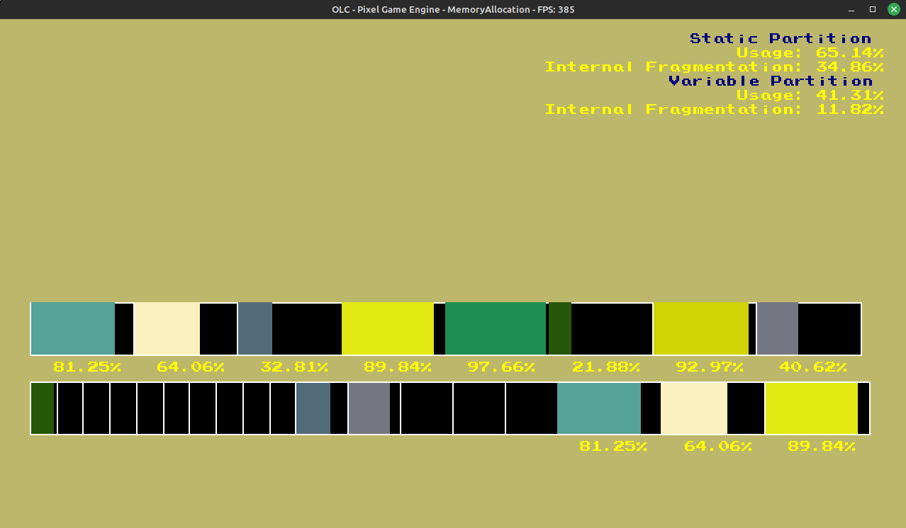

# Alocação de memória SO

Visualização dos modos de particionamento de memória estático e variável utilizados pelo Sistema Operacional para realização da alocação de memória. <br>
Este projeito foi feito utilizando como base a implementação [BinPacking2D](https://github.com/lucaszm7/AED3_Bin_Packing). Que utiliza a engine [olcPixelGameEngine](https://github.com/OneLoneCoder/olcPixelGameEngine).


## Demo


https://user-images.githubusercontent.com/88675696/229371416-092706d9-4d42-46ff-b9d5-874cb67a9a39.mp4




## Build: Linux
 1. Instale as dependências
   ```
   make install
   ```
 2. Compile o Programa 
   ```
   make
   ```
 3. Rode :)
   ```
   make run
   ```

## Build: Windows
  1. Remova o compilador MinGW instalado
  2. Instale o MSYS2
  ```
    winget install MSYS2.MSYS2
  ```
  3. Atualize o MSYS2, abra o terminal do MSYS2 e digite
  ```
  pacman -Syu
  ```
  4. Instale o MinGW pelo MSYS2
  ```
  pacman -S mingw-w64-x86_64-gcc
  ```
  5. Instale o Make (Caso ainda não tenha instalado)
  ```
  winget install 


GnuWin32.Make
  ```
  6. Adicione o Make ao PATH, o caminho é `C:\Program Files (x86)\GnuWin32\bin`
  7. Adicione o MinGW ao PATH, o caminho padrão é `C:\msys64\mingw64\bin`
  8. Compile o programa
  ```
  make windows
  ```
  9. Rode o programe
  ```
  make run_windows
  ```

## Keyboard

Q -> zoom out <br>
E -> zoom in <br>
W, A, S, D -> move screen<br>
C -> reset screen position and zoom<br>
B -> Creates a big random 1D rectangle <br>
N -> Creates a medium random 1D rectangle <br>
M -> Creates a small random 1D rectangle <br>
U -> Insert rectangles with best fit <br>
I -> Insert rectangles with first fit <br>
O -> Insert rectangles with worst fit <br>
BACKSPACE -> Remove one random item <br>
R -> Clear the memory <br>

